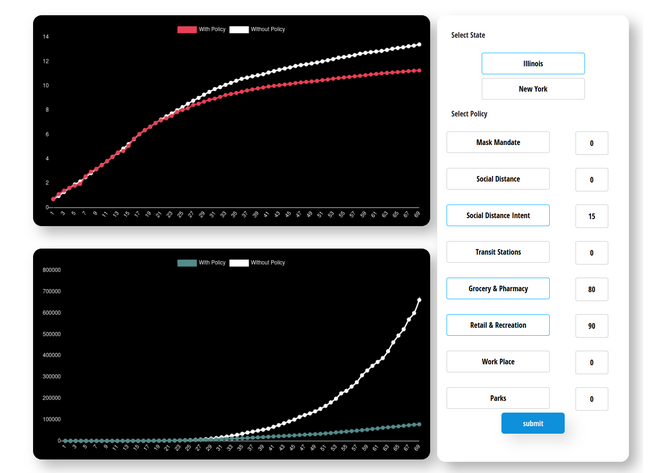

### Interactive simulation tool to analyze the effect of government

We  provide an interactive simulation tool which will help to visualize the effectiveness of anti-contagion government policies.
We used a reduced econometric form model along modified SIR Model to evaluate the current situation, and analyze the data to estimate the parameters to show a correlation (inverse) in the spread of infection rate and policies enforced and its acceptability among people.

##### Code

All of this project is developed using Python3 for the backend and HTML, CSS and 
JavaScript for the front-end development. We using Chart.js library to plot
the graphs of our model simulation. 

#### Execution
In order to execute this you should have Python3 installed on your system. Once you make sure about that execute

`$ python3 server.py`

This will fire up the flask server for the back-end. Now go to
`https://localhost:1234` in your browser and start interacting with
the tool. 

#### Website Snapshot

